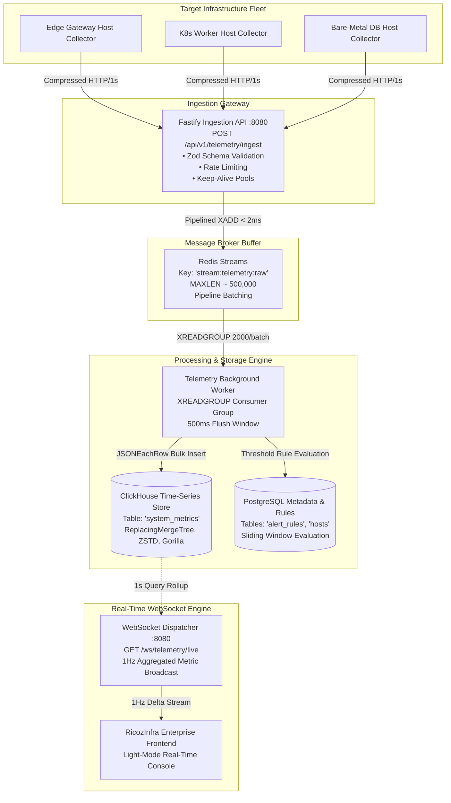

# RicozInfra — Distributed Telemetry Ingestion Pipeline & Real-Time Engine

Production-grade, high-throughput telemetry ingestion pipeline, time-series columnar store, and real-time streaming engine for **RicozInfra**. Designed to ingest, buffer, store, evaluate, and broadcast sub-second metrics across 10,000+ distributed hosts without write bottlenecks or query latency.

---

## 1. System Architecture & High-Concurrency Data Flow



---

## 2. Directory Layout

```
backend/
├── .env.example                     # Production configuration template
├── package.json                     # Node.js dependencies & scripts
├── tsconfig.json                    # TypeScript compiler options
├── README.md                        # Architectural specification & guide
├── collector/
│   ├── collector.ts                 # TypeScript / Node.js lightweight host agent
│   └── collector.go                 # Standalone Golang daemon (<10MB static binary)
└── src/
    ├── config.ts                    # Strongly-typed environment configuration
    ├── server.ts                    # Fastify Ingestion Gateway & WS endpoint
    ├── types/
    │   └── telemetry.ts             # Zod validation schemas & TypeScript models
    ├── queue/
    │   └── redisStream.ts           # High-concurrency Redis Streams producer
    ├── db/
    │   ├── clickhouse.ts            # ClickHouse client & bulk stream inserter
    │   ├── postgres.ts              # PostgreSQL connection pool & alert engine
    │   └── schema.sql               # ClickHouse & PostgreSQL DDL migration scripts
    ├── workers/
    │   └── telemetryWorker.ts       # Background XREADGROUP consumer & alert evaluator
    └── ws/
        └── dispatcher.ts            # Real-time 1Hz WebSocket broadcast bus
```

---

## 3. High-Concurrency Optimizations

1. **Decoupled Buffer Pattern (Redis Streams)**:
   - Ingestion HTTP handler never touches disk or heavy databases directly.
   - Pushes payloads into Redis Stream (`stream:telemetry:raw`) using pipelined `XADD` with capped memory (`MAXLEN ~ 500,000`).
   - Responds to agent in `< 2.5ms` with `202 Accepted`.

2. **ClickHouse Columnar Bulk Ingestion**:
   - The background worker groups telemetry into bulk chunks of `2,000` rows every `500ms`.
   - Ingests via ClickHouse's high-speed `JSONEachRow` streaming format.
   - Data stored in `system_metrics` using `DoubleDelta` and `Gorilla` floating-point codecs, achieving over **85% data compression** on disk.

3. **Stateful Alert Evaluation Engine**:
   - PostgreSQL alert rules are cached in memory for 30 seconds to eliminate database read bottlenecks during high ingestion bursts.
   - Stateful breach windows track consecutive threshold breaches per host/rule to enforce `duration_seconds` (e.g. CPU > 90% for 5 mins / 300s) before raising alerts, eliminating false positive alerts.

4. **Zero-Overhead WebSocket Broadcasting**:
   - Live fleet metrics are aggregated at 1-second intervals from memory/ClickHouse rollups, serialized once to JSON, and broadcast to all connected WebSocket clients without per-client query overhead.

---

## 4. Local Quickstart (Docker Compose)

### Step 1: Start Infrastructure Containers

Create a `docker-compose.yml` for ClickHouse, Redis, and PostgreSQL:

```yaml
version: '3.8'

services:
  redis:
    image: redis:7-alpine
    ports:
      - "6379:6379"

  clickhouse:
    image: clickhouse/clickhouse-server:latest
    ports:
      - "8123:8123"
      - "9000:9000"
    ulimits:
      nofile:
        soft: 262144
        hard: 262144

  postgres:
    image: postgres:16-alpine
    environment:
      POSTGRES_DB: ricozinfra_metadata
      POSTGRES_USER: postgres
      POSTGRES_PASSWORD: postgres
    ports:
      - "5432:5432"
```

Start the containers:
```bash
docker compose up -d
```

### Step 2: Apply Database Schemas

Execute `src/db/schema.sql`:
```bash
# Apply PostgreSQL DDL
psql -h localhost -U postgres -d ricozinfra_metadata -f src/db/schema.sql

# Apply ClickHouse DDL
clickhouse-client --queries-file src/db/schema.sql
```

### Step 3: Install & Start Ingestion Gateway

```bash
cd backend
npm install
npm run dev
```

### Step 4: Run Host Collector Daemon

Run the TypeScript collector:
```bash
npm run collector
```

Or compile and run the Go collector binary:
```bash
cd collector
go run collector.go
```

---

## 5. API Reference

### 1. Ingest Telemetry
- **Method**: `POST`
- **Path**: `/api/v1/telemetry/ingest`
- **Headers**: `Content-Type: application/json`, optional `Content-Encoding: gzip`
- **Payload**:
  ```json
  {
    "host_id": "c73e34b2-2980-4c31-90c7-123456789abc",
    "hostname": "prod-edge-gw-01",
    "cluster": "us-east-cluster-01",
    "role": "Edge-Gateway",
    "timestamp": "2026-10-02T06:03:00.000Z",
    "metrics": {
      "cpu_utilization": 94.2,
      "memory_pressure_pct": 88.0,
      "disk_read_mb": 18.2,
      "packet_loss_pct": 4.82,
      "rtt_ms": 182.0,
      "active_sockets": 48290
    }
  }
  ```
- **Response** (`202 Accepted`):
  ```json
  {
    "status": "accepted",
    "ingested_count": 1,
    "stream": "stream:telemetry:raw",
    "timestamp": "2026-10-02T06:03:00.042Z"
  }
  ```

### 2. Live WebSocket Stream
- **Endpoint**: `ws://localhost:8080/ws/telemetry/live`
- **Broadcast Event** (Emitted every 1 second):
  ```json
  {
    "type": "FLEET_TELEMETRY_DELTA",
    "timestamp": "2026-10-02T06:03:01.000Z",
    "summary": {
      "fleet_nodes_active": 1428,
      "fleet_nodes_total": 1432,
      "global_avg_cpu_pct": 44.6,
      "aggregate_throughput_gbps": 148.6,
      "mean_rtt_ms": 4.2,
      "aggregate_packet_loss_pct": 0.002,
      "active_tcp_connections": 48290,
      "active_p1_incidents": 1
    }
  }
  ```

### 3. Health & Readiness Check
- **Path**: `GET /api/v1/telemetry/health`
- **Response** (`200 OK`):
  ```json
  {
    "status": "nominal",
    "uptime_seconds": 3600,
    "components": {
      "ingestion_api": "healthy",
      "redis_stream_buffer": "healthy",
      "clickhouse_store": "healthy",
      "postgres_metadata": "healthy"
    },
    "ws_connected_clients": 4
  }
  ```
